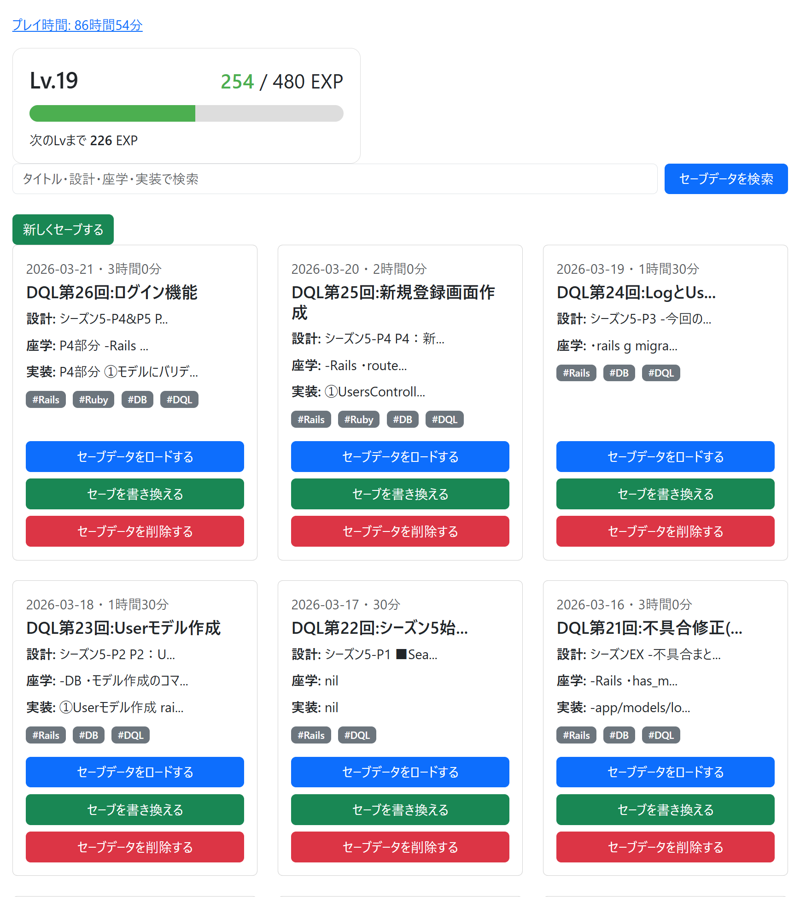
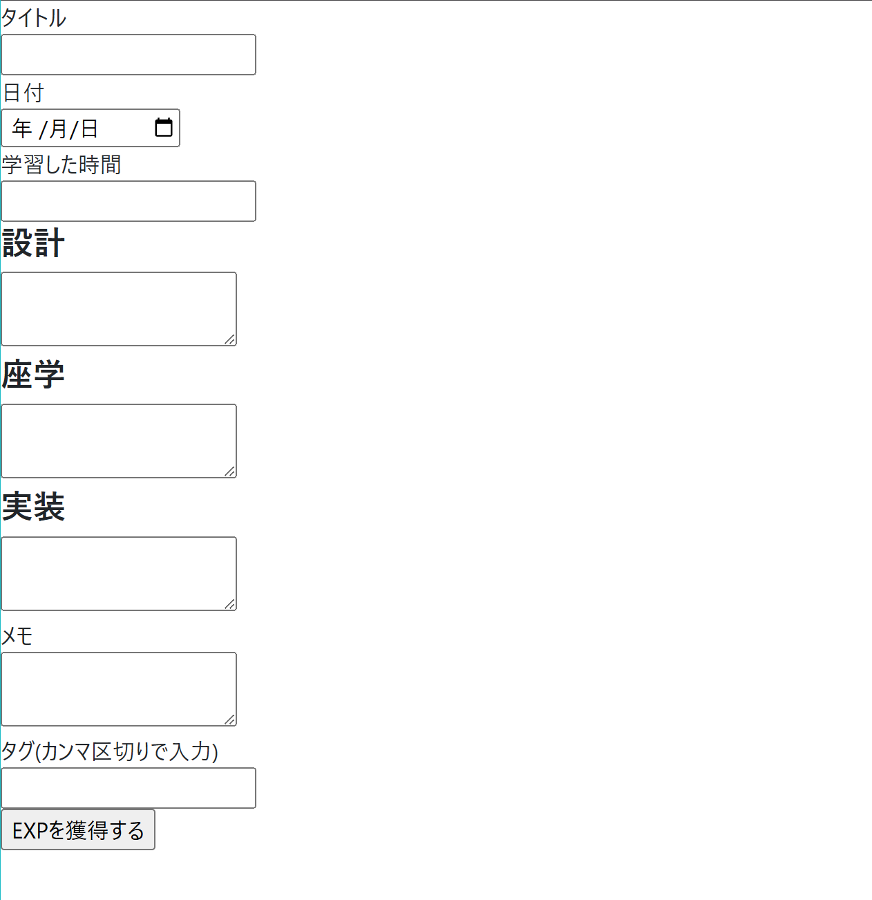
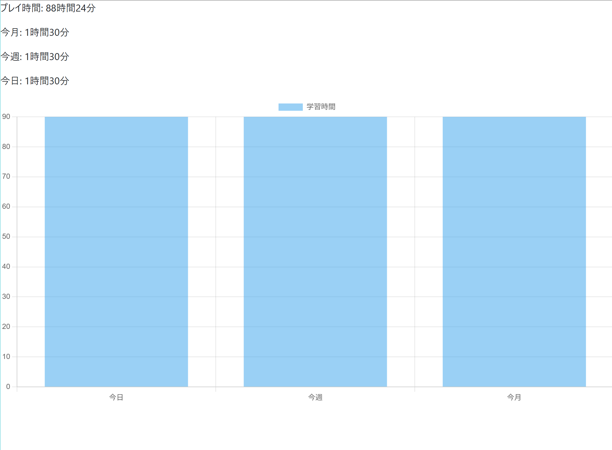

# Daily Quest Log

Daily Quest Log は、日々の学習記録を「ゲームのセーブデータ」のように管理できる学習ログアプリです。

学習内容、学習時間、タグを記録し、検索・タグ別表示・学習時間の集計・レベル表示・グラフによる可視化を行うことで、学習の積み重ねを楽しく確認できるようにしました。

## アプリ概要

学習を継続するうえで、「どれくらい勉強したか」「何を学んだか」「どの分野を積み上げているか」を後から見返せることは重要です。

Daily Quest Log では、学習ログを単なるメモではなく、RPGのセーブデータのように扱います。

学習時間はプレイ時間として集計され、ログの作成や学習時間に応じてEXPが加算されます。これにより、日々の学習をゲームの進行のように可視化できます。

## URL

※デプロイ後に記載予定

- アプリURL：デプロイ後に追記予定
- GitHubリポジトリ：https://github.com/semi141/daily_quest_log

## 使用技術

- Ruby 3.3.3
- Ruby on Rails 7.2.3
- Bundler 2.7.2
- SQLite3
- HTML
- CSS
- Bootstrap
- JavaScript
- Chart.js
- Git / GitHub

## 主な機能

### 学習ログ機能

- 学習ログの新規作成
- 学習ログの詳細表示
- 学習ログの編集
- 学習ログの削除

記録できる内容は以下です。

- タイトル
- 日付
- 学習時間
- 設計内容
- 座学内容
- 実装内容
- メモ
- タグ

### タグ機能

学習ログにタグを付けて管理できます。

タグをクリックすると、そのタグが付いたログだけを一覧表示できます。

例：

- Rails
- Ruby
- DB
- DQL

### 検索機能

タイトル、設計、座学、実装内容を対象にキーワード検索できます。

学習内容を後から見返すときに、特定のテーマに関するログを探しやすくしています。

### 学習時間の集計機能

学習時間を以下の単位で集計できます。

- 累計学習時間
- 今月の学習時間
- 今週の学習時間
- 今日の学習時間

### レベル・EXP機能

学習時間やログ数をもとにEXPを計算し、現在のレベルや次のレベルまでに必要なEXPを表示します。

学習の積み重ねをゲームのステータスのように確認できます。

### グラフ表示機能

Chart.js を使用して、今日・今週・今月の学習時間をグラフで表示します。

数値だけでなく、視覚的にも学習状況を確認できます。

## 画面イメージ

### ログ一覧画面

レベル・EXP・検索・タグ・学習ログを一覧で確認できます。



### 学習ログ入力画面

設計・座学・実装・学習時間・タグを記録できます。



### 学習統計画面

今日・今週・今月の学習時間をグラフで確認できます。



## 工夫した点

### 1. 学習記録をゲーム風に表現したこと

単なる学習メモではなく、「セーブデータ」「プレイ時間」「EXP」「レベル」といった表現を使うことで、学習を継続しやすくなるように工夫しました。

### 2. 学習内容を複数の視点で記録できるようにしたこと

ログには、設計・座学・実装という項目を用意しました。

これにより、ただ作業時間を記録するだけでなく、「何を考えたか」「何を学んだか」「何を実装したか」を分けて振り返れるようにしています。

### 3. タグと検索で過去ログを探しやすくしたこと

学習ログは増えるほど見返しにくくなるため、タグ機能とキーワード検索機能を実装しました。

タグごとの一覧表示や、複数カラムを対象にした検索によって、過去の学習内容を探しやすくしています。

### 4. 学習時間を可視化したこと

累計学習時間だけでなく、今日・今週・今月の学習時間を表示し、さらにグラフでも確認できるようにしました。

継続状況が分かりやすくなることで、学習のモチベーション維持につながるようにしています。

## 苦労した点

### 1. RailsのCRUD処理の理解

最初は、new / create / edit / update / destroy の役割の違いや、ルーティングとのつながりを理解するのに苦労しました。

実装を進める中で、各アクションの責務や、フォームから送信されたデータがどのように保存されるかを学びました。

### 2. タグ機能の実装

タグ機能では、Log と Tag の間に中間テーブル LogTag を作成し、has_many :through を使って関連付けを行いました。

また、タグの重複登録や、編集画面で既存タグを表示する処理にも対応しました。

### 3. 学習時間の集計と表示

分単位で保存した学習時間を、「○時間○分」の形式に変換する helper を作成しました。

また、今日・今週・今月の範囲で学習時間を集計する処理を実装しました。

### 4. Chart.js と Rails の連携

Rails側で集計した値をJavaScriptに渡し、Chart.jsでグラフとして表示する処理に取り組みました。

Turboの影響でJavaScriptが意図通りに実行されない場面もあり、通常遷移に切り替えることで対応しました。

## 今後の改善点

- ログイン機能の実装
- ユーザーごとの学習ログ管理
- ゲストログイン機能
- スマートフォン表示の改善
- UIデザインの改善
- 学習カテゴリ別の集計
- 月別・週別グラフの強化

## ローカルでの起動方法

```bash
git clone リポジトリURL
cd daily_quest_log
bundle install
rails db:create
rails db:migrate
rails s

ブラウザで以下にアクセスします。
http://localhost:3000